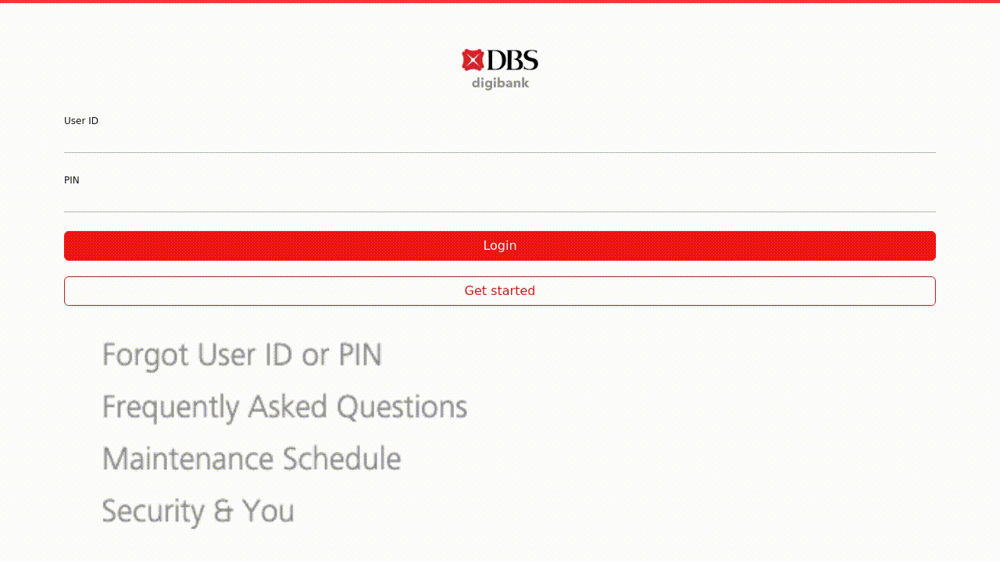

# PhishFlood

PhishFlood is a Python tool that utilizes the Playwright library to automate the process of filling phishing websites with fake credentials. This project is designed for educational and research purposes only. Please use it responsibly and ethically.

> **_NOTE_** This tool is meant for educational and research purposes only. Unauthorized use of this tool is strictly prohibited. The developers are not responsible for any misuse or damage caused by this tool.

## Table of content
- [PhishFlood](#phishflood)
  - [Table of content](#table-of-content)
  - [Demo](#demo)
  - [Installation](#installation)
    - [Prerequisites](#prerequisites)
    - [Clone the Repository](#clone-the-repository)
    - [Install Dependencies with Poetry](#install-dependencies-with-poetry)
  - [Usage](#usage)
    - [Running CLI](#running-cli)
    - [Running the API](#running-the-api)
  - [Testing](#testing)
  - [Contributing](#contributing)
    - [Architecture](#architecture)
  - [License](#license)

## Demo

Example gif:


Example output:
```json
{
    "url": "https://online.ib-internet-bakingssg.com/",
    "html": "...",
    "forms": [
        {
            "meta_id": 0,
            "id": null,
            "action": null,
            "method": "none",
            "type": null,
            "inputs": [
                {
                    "meta_id": 0,
                    "id": null,
                    "name": "UID",
                    "placeholder": null,
                    "type": "text"
                },
                {
                    "meta_id": 1,
                    "id": null,
                    "name": "pin",
                    "placeholder": null,
                    "type": "number"
                }
            ]
        }
    ],
    "actions": [
        {
            "action": "fill",
            "form": 0,
            "input": 0,
            "value": "cyber_dragon83",
            "status": "success"
        },
        {
            "action": "fill",
            "form": 0,
            "input": 1,
            "value": "383510",
            "status": "success"
        }
    ]
}
```


## Installation

### Prerequisites

- Python 3.11 or higher
- Git
- Poetry

### Clone the Repository

```bash
git clone https://github.com/solanav/phishflood.git
cd phishflood
```

### Install Dependencies with Poetry

```bash
poetry install
```

## Usage

### Running CLI

```bash
poetry run python -m phishflood example.org
```

PhishFlood will launch a Playwright browser instance in the background and start filling in fake credentials on known phishing websites. The results will be stored on the `samples/` directory.

### Running the API

```bash
docker compose -f docker/docker-compose.yml up --build
```

## Testing

We use [pytest](https://docs.pytest.org/en/stable/) for testing. To run the tests, use the following command:

```bash
poetry run pytest
```

Make sure to have a controlled testing environment, as the tests involve interactions with websites.

## Contributing

If you would like to contribute to this project, please open an issue or submit a pull request. We welcome any suggestions, improvements, or bug fixes.

### Architecture

Here is a general overview of the code in this repository so you have an easier time contributing:
- `api/`: django project that provides the API to submit new cases and retrieve results.
- `credfind/`: module that finds forms and inputs in a given HTML source file.
- `credgen/`: module that generates random (realistic) credentials for inputs found in `credfind`.
- `data/`: folder with emails and passwords for the `credgen` module.
- `docker/`: contains the docker-compose and Dockerfiles necesary to get up and running the service.
- `pages/`: HTML sites to test the modules.
- `phishflood/`: main module that glues credfind and credgen, using [playwright](https://github.com/microsoft/playwright-python).
- `samples/`: output for the information obtained when using the `phishflood` manually as opposed to using it through the API.
- `tests/`: folder containing the unittests that check everything is behaving as expected.
- `entrypoint.sh`: script that prepares the django `api` and launches it. Used in `docker/Dockerfile.api`.

## License

This project is licensed under the [AGPL License](LICENSE).
